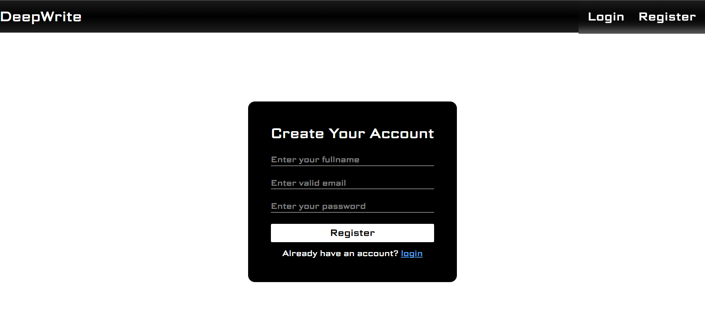
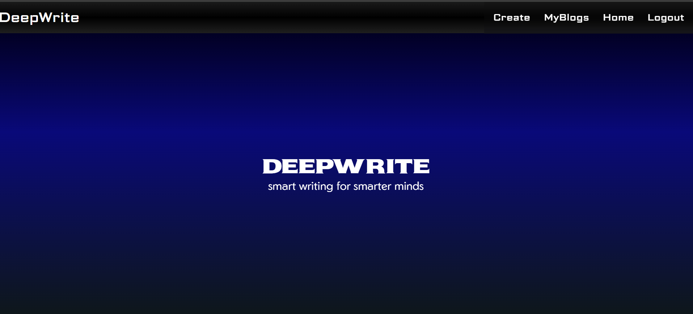
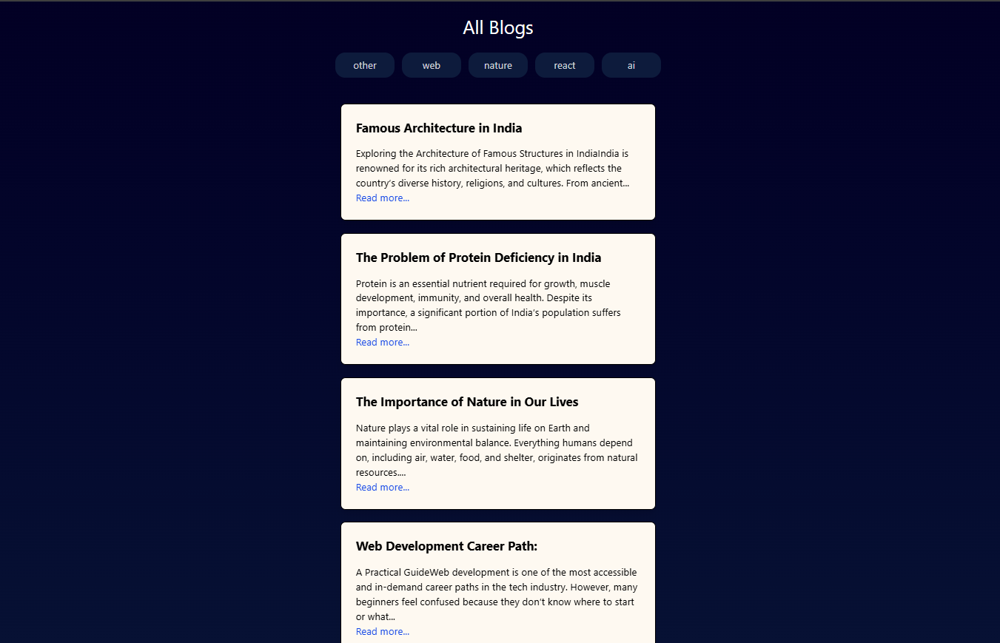
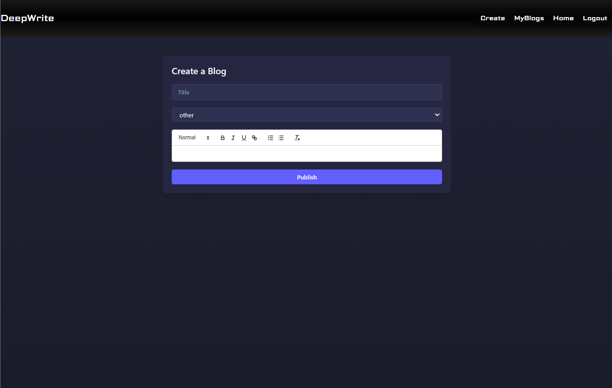

### MERN BLOG Application

This is a full-stack MERN blog application implementing authentication,authorization, role-based access control.Users can create,read,delete, their own blogs, read other user's blogs as well, and post comment on other blogs. Users can read blogs by categories.Ownership-based permissions are enabled on the backend using JWT authentication and middleware.

## Features

- User authentication using JWT
- Role-based access control (RBAC)
- Users can create and delete their own blogs
- Users can read all blogs
- Users can comment on any blog
- Users can delete only their own comments
- Secure backend authorization (not UI-only)

## Comments
- Any logged-in user can comment on any blog
- User can delete only their own comments

## Tech Stack

### Frontend
- React
- Redux Toolkit
- Axios
- TailwindCSS
- React Router
- ReactQuill(rich text editor)

### Backend
- Node.js
- Express.js
- Mongoose
- JWT Authentication(cookies)

## Demo of Blog App

### ScreenShots
- login page

- homepage

- BlogDetails Page

- All Blogs Page (category)

- MyBlogs Page

- CreateBlog Page

